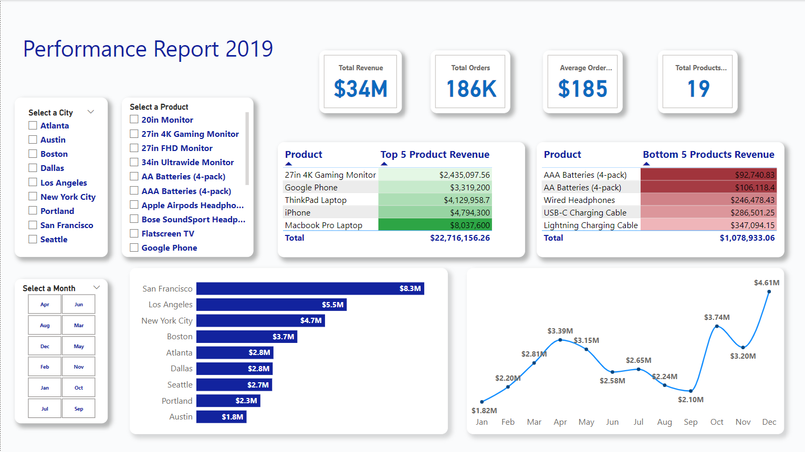

# Sales 2019 Report - Power BI Dashboard

## Project Overview
This Power BI dashboard provides insights into sales performance for the year 2019. It analyzes key metrics such as total sales, regional performance, and product trends.

## Features
- **Total Sales Analysis**: Visuals showing overall sales performance.
- **Regional Breakdown**: A detailed view of sales across different regions.
- **Product Trends**: Highlights top-performing products and sales trends.
- **Interactive Filters**: Dynamic filters for better exploration of data.

## Tools Used
- **Power BI**: For dashboard creation and data visualization.
-SQL Server: Data Analysis.
- **Excel / CSV**: Data Cleaning.

## Screenshot

## How to View the File
1. Download the `.pbix` file from this repository.
2. Open it in **Power BI Desktop**.
3. Explore the interactive dashboard and visuals.

## Contact
For more details, reach out to me on:
- **LinkedIn**: www.linkedin.com/in/eric-phan-81b73728a
- **Email**: Ephan1296@gmail.com
